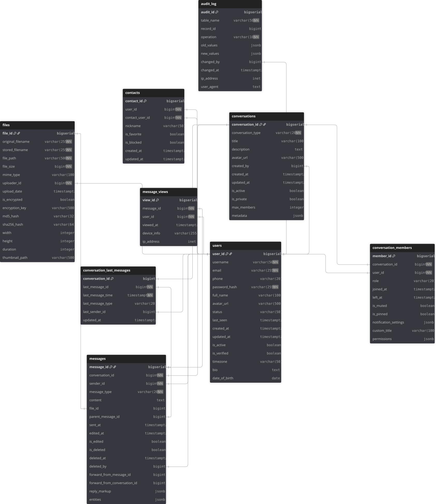

# **База данных для мессенджера**

### **Цель проекта**
Спроектировать и реализовать реляционную базу данных для мессенджера с **полным соответствием нормальной форме Бойса-Кодда (НФБК)** и поддержкой:
- Регистрации и аутентификации пользователей
- Системы контактов и друзей
- Различных типов диалогов (личные, групповые, каналы)
- Обмена сообщениями разных типов (текст, файлы, медиа, стикеры, голосовые)
- Прикрепления файлов и медиа с метаданными
- Отслеживания статуса прочтения сообщений
- Полного аудита всех операций в системе

### **Предметная область**
**Мессенджер** — приложение для мгновенного обмена сообщениями между пользователями с соблюдением строгих принципов нормализации данных, готовое к высоким нагрузкам и обеспечивающее целостность информации на уровне базы данных.

### **Выделение ключевых сущностей**

1. **Пользователи** (`users`) - ядро системы, профили и учетные записи
2. **Контакты** (`contacts`) - двусторонние связи между пользователями
3. **Диалоги** (`conversations`) - контейнеры для общения (личные/групповые/каналы)
4. **Участники диалогов** (`conversation_members`) - связь пользователей с диалогами, роли и права
5. **Файлы** (`files`) - загруженный контент с хэшами и метаданными
6. **Сообщения** (`messages`) - единицы общения с автоматическим полнотекстовым поиском
7. **Просмотры сообщений** (`message_views`) - история прочтения с данными об устройстве
8. **Последние сообщения диалогов** (`conversation_last_messages`) - отдельная таблица для соблюдения НФБК
9. **Журнал аудита** (`audit_log`) - отслеживание всех изменений в системе (INSERT/UPDATE/DELETE)

### **Определение связей между сущностями**

**Один-ко-многим (1:N):**
- `users` → `contacts` (пользователь имеет много записей в списке контактов)
- `users` → `conversation_members` (пользователь может участвовать во многих диалогах)
- `conversations` → `conversation_members` (диалог может содержать много участников)
- `conversations` → `messages` (диалог содержит историю сообщений)
- `users` → `messages` (пользователь является отправителем многих сообщений)
- `files` → `messages` (файл может быть прикреплён к нескольким сообщениям, связь необязательная)
- `messages` → `message_views` (сообщение может быть просмотрено многими пользователями)
- `users` → `audit_log` (пользователь может совершать множество аудируемых действий)
- `messages` → `messages` (рекурсивная связь для ответов на сообщения через `parent_message_id`)

**Многие-ко-многим (M:N):**
- `users` ↔ `users` через `contacts` (симметричные/асимметричные отношения между пользователями)
- `users` ↔ `conversations` через `conversation_members` (много пользователей могут быть в много диалогах)

**Один-к-одному (1:1):**
- `conversations` ↔ `conversation_last_messages` (каждому диалогу соответствует ровно одна запись с кэшированным последним сообщением для соблюдения НФБК и оптимизации)

### **ERD**

### **Нормализация**

#### **1. Первая нормальная форма (1НФ)**
- Все таблицы имеют первичный ключ
- Все значения атомарны
- Нет повторяющихся групп

#### **2. Вторая нормальная форма (2НФ)**
- Все неключевые атрибуты полностью зависят от первичного ключа
- Нет частичных зависимостей от составных ключей
- Пример: в `contacts` все поля зависят от всего ключа `(user_id, contact_user_id)`

#### **3. Третья нормальная форма (3НФ)**
- Нет транзитивных зависимостей
- Все неключевые атрибуты зависят только от первичного ключа
- Пример: в таблицах нет ситуаций, где A → B → C, и B не является ключом

#### **4. Нормальная форма Бойса-Кодда (НФБК)**
- Все детерминанты являются потенциальными ключами
- Устранены все аномалии, оставшиеся в 3НФ